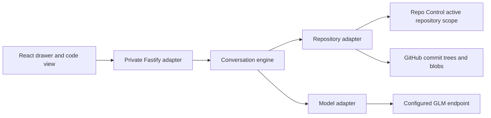

# AI-assisted PR exploration

Repo Control lets the person ask questions about a pull request and read the
answer alongside the referenced code. Open **Ask agent** in the review header.
Start guided review proposes a reading order. Typing a question starts freeform
review. Both paths use the same conversation, retrieval rules and response
contract. A person following a guide can ask a question at any point.

This document records the implementation and its limits. It also explains the
module boundaries intended to support a possible standalone desktop review app.
There is no Electron dependency or desktop process in this change.

## Ownership and dependencies



| Module | Owns | Does not own |
| --- | --- | --- |
| `src/exploration/contracts.ts` | Versioned decisions, selections, source references, runtime validation and adapter types. | HTTP, GitHub, persistence or rendering. |
| `src/exploration/engine.ts` | Sessions, context budgets, retrieval rounds, source IDs, action authorization, cancellation and duplicate turns. | Credentials, repository transport or browser navigation. |
| `src/exploration/github.ts` | Active-repository checks, revision verification, bounded GitHub tree/blob reads and literal text search. | Model behavior or UI controls. |
| `src/exploration/provider.ts` | One bounded GLM completion and its provider envelope checks. | Tool execution, navigation or conversation state. |
| `src/exploration/plugin.ts` | Private HTTP routes, origin checks, request limits and redacted error responses. | Review decisions or GitHub writes. |
| `src/web/exploration/` | Conversation state in the tab, initial choice, composer, reading steps and code-attached explanations. | Credentials or repository reads. |
| Existing `DiffOverlay` | Opens the drawer, supplies selected lines, saves review position and returns from code destinations. | Conversation orchestration. |

The engine depends on two injected interfaces, `ExplorationRepository` and
`ExplorationModel`. Their values use plain data and `AbortSignal`. The only
runtime default outside those interfaces is session ID generation through Web
Crypto; tests or another host can supply a clock and ID function.

The priority classifier remains independent. Its worker, durable priority jobs,
retry count, output validator and no-tools request contract have not changed.
Interactive exploration uses the same configured endpoint and server-side key,
but it creates its own provider adapter and requests. It does not spend a
priority classification attempt or run through the background worker.

This separation is deliberate. A desktop host could supply a local Git adapter
and expose the same session operations over a restricted IPC API. It would keep
provider credentials in its main process and keep the renderer on the same
validated data contract. Replacing React, adding local Git access, durable
sessions or desktop credential storage would be separate work. There is no
plugin registry, generic agent framework or arbitrary command executor to carry
into that application.

## Enablement and data disclosure

Exploration is available when the existing priority endpoint and API key are
configured. The diff API advertises `explorationEnabled`. Without those
settings, the button and exploration routes are absent. The existing endpoint
allowlist and configuration validation still run during server startup.

Opening the drawer sends no model request. Starting a guide or sending a
question creates the session and submits the turn. The first-send screen says
that PR excerpts and requested source from this repository go to the configured
AI provider. This is broader evidence than file classification: retrieval may
read unchanged source files in the same repository.

The GitHub credential stays in the repository adapter; the model key stays in
the provider adapter. Neither appears in the browser API or prompt content.
There are no prompt or source logs. The HTTP adapter returns fixed error codes
without provider response text, paths from exceptions or credentials.

The application remains a private, single-account self-hosted service. Session
IDs are unguessable bearer identifiers inside that private application. They
are not a substitute for user authentication in a multi-user installation. A
future multi-user host must bind every session and repository adapter to the
requesting principal. The production artifact viewer cannot call these routes.

## What a turn contains

The browser sends a question, a unique turn ID, a guided flag and an optional
selection. It does not submit repository code as trusted evidence.

```json
{
  "turnId": "turn-7",
  "message": "What happens to a late Friday order?",
  "guided": false,
  "selection": {
    "path": "src/shipping/delivery.ts",
    "side": "RIGHT",
    "startLine": 18,
    "endLine": 24
  }
}
```

Sending captures the selection for that turn. Subsequent selection changes do
not alter the submitted request. Removing selected context changes later turns
to PR-level questions. Explain selection and Find usages are ordinary questions
with that explicit selection attached. A symbol selection is currently a line
range; if the range contains several possible symbols, the model is instructed
to ask which one the person means.

The engine provides the model with:

- PR title and bounded description;
- the reviewed head and a bounded changed-path manifest;
- patch excerpts and any subsequently retrieved source, each with a source ID;
- the current question and its selection;
- up to three recent exchanges within a separate byte budget;
- explicit evidence and history limitations;
- whether the current round is the last permitted round.

System instructions describe the task, protocol and allowed actions. Everything
from the repository, including descriptions, paths, comments and source, is
untrusted evidence. It cannot redefine the protocol or authorize an operation.
Previous assistant text is also evidence, not authority.

## Revision and source identity

Session creation records the head commit and the current base commit. The
adapter checks both before subsequent reads and turns. A change to either
invalidates continued exploration, including an idempotent turn replay. The
engine verifies the revision again after the model responds, before returning
any action to the browser.

RIGHT means source at the reviewed head. LEFT means source at the comparison's
merge base. The adapter resolves the merge base from the fixed base and head
commits through GitHub's compare endpoint. For a renamed file, it reads the old
path on LEFT while preserving the diff's current path as the UI identity.
Deleted paths therefore remain inspectable on the base side. It never replaces
a missing source with a moving branch version.

Initial patch excerpts use the parsed diff line coordinates. An excerpt contains
only consecutive lines on one side; a gap ends it. Retrieved code uses Git trees
and blobs pinned to a commit. Tree entries must be ordinary file modes, and the
adapter never follows a symlink or submodule or executes repository content.

A source ID identifies one path, side and contiguous range inside a session.
Only the engine assigns it. The model may refer to an existing ID; it cannot
create a browser destination by inventing a path. The returned source includes
the exact excerpt used as evidence. Opening a result can therefore display code
outside the visible patch without fetching a different revision.

GitHub may not make a fork commit's source available through the base repository.
That read returns unavailable evidence. This implementation does not switch to
an arbitrary repository supplied by the model or use an unverified fallback.

## Retrieval and large repositories

The initial evidence is a sample of patch excerpts, not an upload of the entire
PR. The model can request a file range or a literal text search. A request is
validated before the repository adapter runs it. Reads execute sequentially
under the turn's shared deadline and read budget.

Search walks a bounded recursive tree at the reviewed head. It reads a page of
up to 40 eligible files and returns up to 30 matching excerpts. A directory
prefix narrows the candidates. An offset selects a later page. The result
states how many files were actually inspected, the prefix and offset, and
whether more files or a truncated tree remain. If the match limit stops a page
early, continuation starts at the next uninspected file. Remaining lines within
the last file are explicitly reported as unsearched and can be requested as a
file range. Binary, oversized, excluded and
unreadable files do not count as inspected text files.

These results are text matches. They can include comments or unrelated symbols
with the same name and miss import aliases, dynamic access and references
outside the search scope. Neither an empty page nor a page without matches
establishes that a function is unused. A language-aware index tied to a commit
would be a later repository-adapter capability; the current UI does not claim
semantic reference resolution.

The path policy excludes dependency/build directories, `.git`, `.env` files,
lock files and common private-key file extensions. It also rejects traversal,
absolute paths, control characters and backslashes. This is a bounded source
policy, not a guarantee that every ordinary source file is free of secrets.
The first-send disclosure therefore describes sending repository source.

| Limit | Current value and consequence |
| --- | --- |
| Sessions | Eight per server, including creation reservations. New creation returns busy at capacity. |
| Lifetime | Thirty minutes idle, reclaimed on the next engine operation; restart loses sessions. |
| Completed turns | Twenty per session. Start a new conversation at the limit. |
| Active turns | One per session. Concurrent submission returns busy. |
| Model rounds | Four per turn, at most eight read requests total and three per decision. |
| Deadline | Ninety seconds for a turn; individual GitHub requests also have a fifteen-second deadline. |
| Question | 8,000 characters; selections contain at most 160 lines. |
| Initial manifest | At most 100 paths and 12 KiB of path bytes. |
| Initial excerpts | At most twelve excerpts, each at most eighty consecutive patch lines. |
| Source file | 48 KiB; a displayed excerpt is at most 8 KiB. |
| Source registry | Eighty excerpts and approximately 48,000 serialized UTF-8 bytes, including metadata. |
| Tree response | 2 MiB. An oversized tree fails the read rather than being silently decoded. |
| Search page | Forty eligible files and thirty matches; offset is bounded to 1,960. |
| History | Three recent exchanges and 24 KiB of serialized history. Older pairs are dropped together. |
| Model request/response | 128 KiB each. Output requests at most 8,192 completion tokens. |
| Answer | 12,000 characters, four UI actions, six guide steps or thirty locations per action. |

These are application resource limits, not assertions about GLM's context
window. Byte limits make costs and failure behavior explicit without depending
on an unverified tokenizer. The request limit still applies after JSON encoding.
A provider context-limit error is a failed turn. This version does not generate
conversation summaries, silently truncate an answer or retry malformed output.

The model sees the retained source registry on every round. Repeated reads of
the same range reuse its ID. When evidence reaches its limit, a notice explains
that more code was omitted. Starting a new conversation releases its accumulated
context. History omission is also reported; the agent cannot rely on earlier
questions that have fallen out of the retained exchanges.

## Model decisions and UI actions

The runtime validators in `contracts.ts` are authoritative. Objects reject extra
keys, unsupported versions, unknown variants, invalid numbers and oversized
collections. The provider validates the outer completion, and the engine
validates the decision again before processing it. The model-facing prompt
describes the same protocol. Native tools remain disabled.

A retrieval decision stays on the server:

```json
{
  "version": 1,
  "kind": "read",
  "requests": [
    { "kind": "search", "query": "deliveryDate", "pathPrefix": "src", "offset": 0 }
  ]
}
```

A file request contains `kind: "file"`, exact path, LEFT or RIGHT, startLine and
endLine. A search uses literal text, never a regular expression or command. The
adapter independently checks the path and pinned repository revision.

A final decision answers the question and can ask a clarification:

```json
{
  "version": 1,
  "kind": "answer",
  "message": "The checkout uses this date in its delivery estimate.",
  "actions": [
    {
      "kind": "explain",
      "sourceId": "s4",
      "text": "The formatter uses the computed working-day date."
    }
  ],
  "question": {
    "text": "Which behavior should we inspect next?",
    "options": ["Weekend handling", "Warehouse cutoff"]
  }
}
```

Supported UI actions are:

- `explain`: one registered source ID and explanation text;
- `locations`: a title and source-ID items with labels and explanations;
- `guide`: an ordered list of source-ID items with labels and explanations.

The engine rejects the entire answer if any source reference is unknown. It
does not return the otherwise-valid actions from that answer. The final browser
response also carries the turn ID and head commit; the client discards a response
for an obsolete request or a different head.

A model action creates a reading option. It never changes the person's file or
scroll position on arrival. Clicking the option opens the referenced code and
its explanation. There are no merge, review submission, edit, shell, arbitrary
URL, HTML or DOM operations in this protocol. Text renders as text. Existing
human merge controls stay in the existing review UI and receive no model input.

Clarifications provide two to five distinct text options plus the ordinary
composer. Only the latest exchange's choices are active. Choosing one sends an
ordinary user message; it grants no new capability. The person can always type
a different answer instead.

## HTTP and session lifecycle

| Private route | Behavior |
| --- | --- |
| `POST /api/exploration/sessions` | Creates a session for `nodeId` and `headSha` after repository and revision checks. |
| `POST /api/exploration/sessions/:id/turns` | Executes a bounded turn. A repeated completed turn ID with identical input returns its result after re-verification. |
| `POST /api/exploration/sessions/:id/cancel` | Aborts active work for this session. |
| `DELETE /api/exploration/sessions/:id` | Cancels and removes the session. |

Cross-site browser requests and mismatched Origin hosts are rejected. All
responses use `Cache-Control: no-store`. The private application network remains
the access boundary. JSON request size limits apply before the engine.

Closing the drawer retains the conversation. Closing the PR cancels work and
requests session deletion. New conversation requests deletion of the old session and clears displayed
exchanges. Idle expiry handles an abandoned
tab whose cleanup request did not arrive. Server shutdown cancels engine work.

Stop aborts browser and server work and invalidates the local request generation.
A provider that completes despite cancellation cannot apply a late result.
Cancellation cannot promise that a provider stops billing a request already
received. There is no automatic retry after failure. The composer retains the
question and the person decides whether to send it again. If the person types a
new question while waiting, success and failure both preserve that new text.
Starting a guide also leaves an in-progress composer draft intact.

Errors distinguish busy, expired, changed revision, cancellation, limits and
invalid/unavailable answers. A changed-revision error disables old conversation
actions and asks the person to close and reopen the review. A new session starts
with the newly loaded diff. Browser reload and server restart intentionally do
not restore conversation history in this version.

## UI decisions

The person's task is to understand a change while looking at the relevant code.
The drawer holds questions and reading choices. Code and its explanation occupy
the main review area. The interface does not repeat a full explanation in chat
and again next to the same code.

The initial screen offers one guided-review action and a usable composer. There
is no mode picker that must be changed before asking a question. A guide is a
suggested reading order within the conversation, not a separate workflow with
its own session. Each step names what to inspect and shows the exact file and
line range. Freeform answers can produce the same locations and explanations.

Selecting a destination opens an excerpt at the pinned revision, with the
explanation immediately below it. The previous diff remains mounted but hidden.
Back restores its aspect, fold state and scroll position. This works for code
outside the patch as well as changed lines. It deliberately avoids pretending
that an unchanged source excerpt is itself a PR patch.

Select text on one diff side, click a line number, or Shift-click another number
to extend a range. The selected path, side and lines appear in the composer and
can be removed. Cross-file and mixed-side text selections are ignored rather
than creating an ambiguous range. Selection is bounded to 160 lines. Line-number
buttons also support keyboard and touch entry without a text-selection popup.

At widths above 800px, the right drawer takes 25rem and code uses the remaining
width. At narrower widths, chat uses the screen; opening a result returns to code.
Ask about this code brings back chat with the excerpt selected. The code view
and chat scroll independently. Long code lines scroll within the code block;
paths and explanations wrap. The whole page must not scroll horizontally.

Escape closes chat first, then the code destination, then the PR review. Closing
chat restores focus to Ask agent. Removing a context control or stopping a turn
moves focus back to the composer. The review's focus trap narrows to the drawer
on small screens. Answers do not take focus or navigate automatically.

The UI uses the existing semantic colors, self-hosted fonts and type roles.
Explanations use the existing surface and accent roles beside code. Search and
missing-evidence details remain available through the Evidence limits disclosure.
The disclosure is visible whenever those limitations exist, including empty
search results. Operational details do not occupy the main code view.

## Validation and remaining work

Unit tests exercise contract rejection, unknown references, retrieval bounds,
revision changes, duplicate turns, cancellation and session expiry. Provider
tests cover wrong models, truncated completions, native tool calls and byte
limits. Repository tests cover renamed base-side reads, base changes, symlinks,
excluded paths, partial search, continuation and hidden repositories. HTTP tests
exercise the full session/turn/delete path and cross-origin rejection.

Browser tests exercise guided entry, code-attached explanations, follow-up
questions, line selection, freeform entry, invalid-answer recovery, context
removal, delayed success/failure with a newer draft, cancellation, stale responses
and return navigation at 1440px, 1024px and 390px in Chromium and WebKit.
Screenshots are temporary local evidence and are not committed.

Provider interaction tests use fictional inputs and a simulated transport. They
do not prove live model quality or latency. The configured deployment must be
exercised with representative PRs after release. Native structured-output or
function-calling support is not assumed: this implementation works through the
existing JSON completion contract and runtime validation. The current provider
can still return an invalid answer, in which case the UI reports failure and
applies no actions.

The next product decisions should come from using this version: whether a guide
needs progress tracking, whether source search needs a local semantic index,
and whether conversations should survive reload. Durable history, model routing,
embeddings, automatic code changes and Electron packaging are outside this PR.

## External contracts

GitHub documents the [commit comparison response](https://docs.github.com/en/rest/commits/commits#compare-two-commits),
[tree entries and truncation](https://docs.github.com/en/rest/git/trees#get-a-tree),
and [Git blob reads](https://docs.github.com/en/rest/git/blobs#get-a-blob).
The adapter uses those REST resources without following response-provided URLs.
DigitalOcean distinguishes [agent and serverless inference APIs](https://docs.digitalocean.com/reference/api/reference/inference-apis/).
The existing provider setup is documented in [AI file priorities](priority-review.md).
