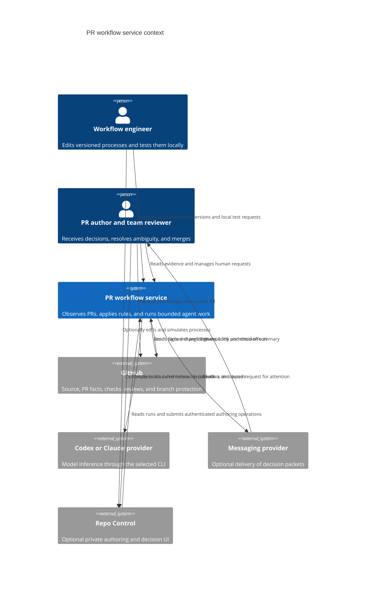
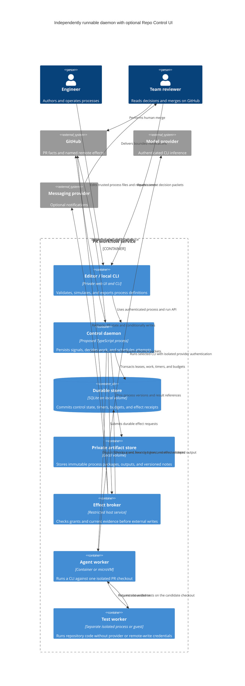
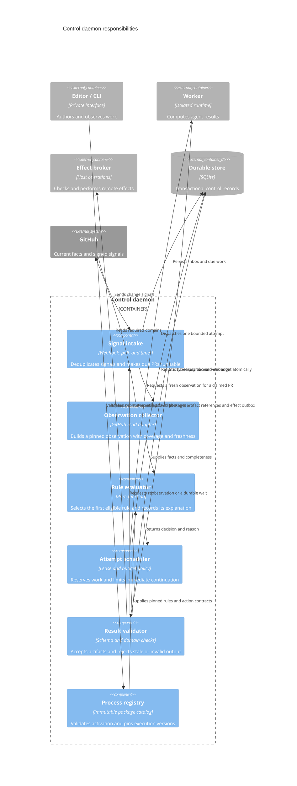
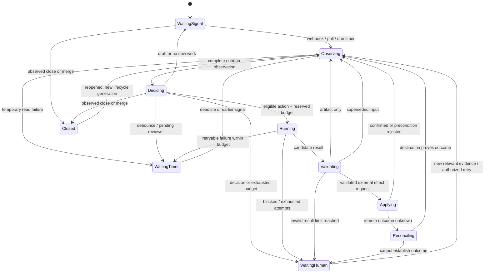
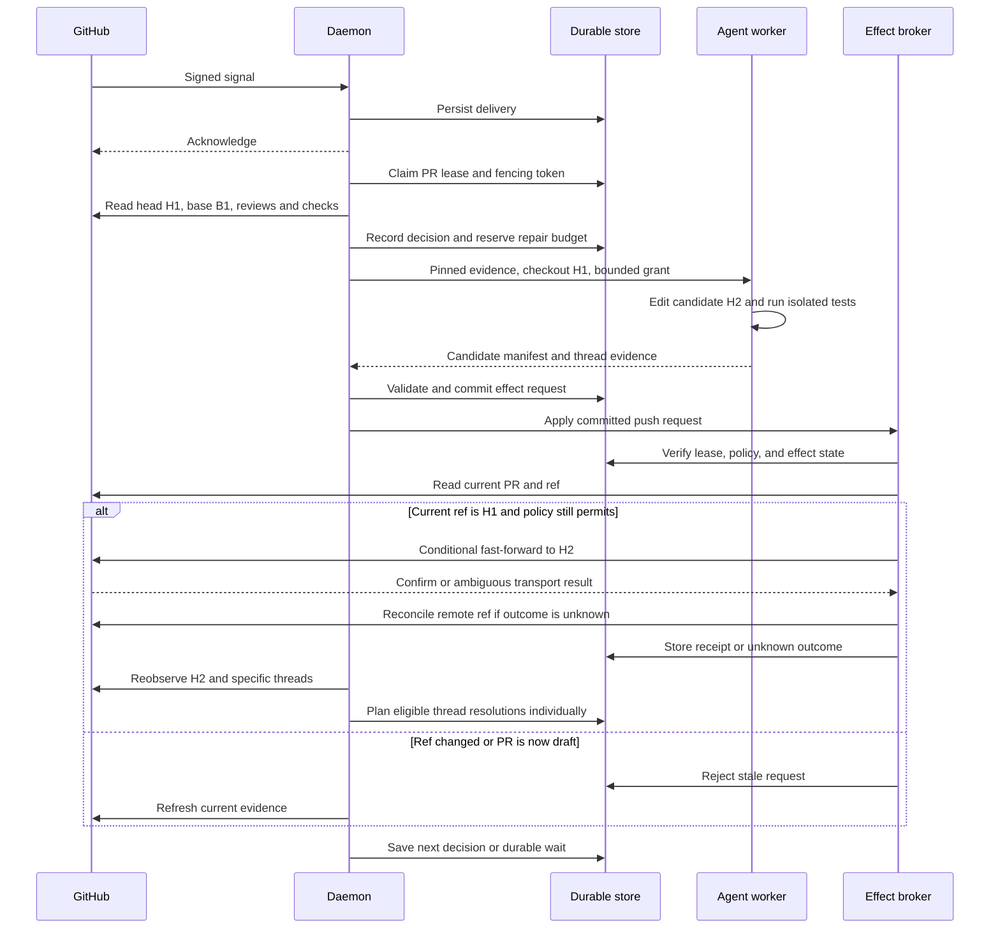
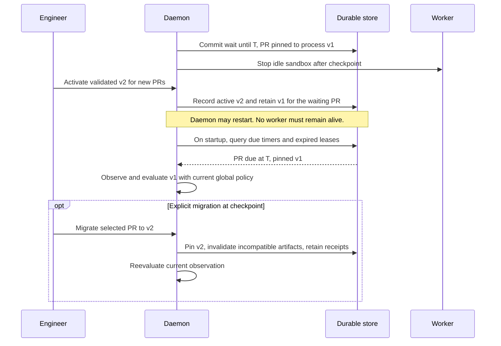

# Architecture proposal

All diagrams describe the proposed system. The current Repo Control application
does not run arbitrary repository code or persist these workflow instances.
C4 uses "container" to mean a separately running application or data store;
the agent sandbox is also an operating-system isolation boundary.

## System context

GitHub remains authoritative for PR facts and merge policy. The service owns
attempts, process progress, budgets, and decision receipts. The public artifact
viewer has no access to private process APIs.

## Containers

The broker can initially be a host module in the daemon process. It must remain
outside repository execution and expose only named operations. The collector
holds read credentials on the host. Workers receive bounded source and evidence
rather than unrestricted credential access. Container separation of CLI auth
and repository test execution must be verified for each provider adapter.

## Control daemon components

These are responsibilities, not a requirement for six packages or interfaces.
The first implementation should keep code together until there is a concrete
reason to split it. A pure evaluator and explicit adapters are useful from the
start because local replay depends on them.

## Process state machine

PR facts are independent inputs. This machine records execution progress.

Every active state also responds to close, draft, permission revocation, and
lease loss at checkpoints. The broker rejects effects immediately when those
preconditions fail. The worker may finish computing after cancellation, but its
result cannot advance the current attempt.

An already-dispatched remote request cannot be recalled. Revocation blocks new
dispatch, and the broker reconciles any request that was already in flight.

## Repair sequence and changed head

## Long wait and process upgrade

## Placement options

| Option | Benefits | Costs and reason to choose |
| --- | --- | --- |
| Module inside Repo Control server | One install; existing SQLite, webhook handling, UI, and settings conventions. | Worker scheduling shares HTTP availability. Team repository scope is a new contract. Reasonable for a small personal prototype if untrusted execution is still external. |
| Independent daemon in this repository | Separate restart and credential boundaries; same language/tooling; optional private UI adapter. | Adds a process/API and deployment configuration. Recommended starting architecture for team use. Source location can change later. |
| Standalone repository and service | Independent release and integration story for teams without Repo Control. | Cross-repository schema changes, duplicated hosting work, and another product interface. Choose when an external user or separate release cadence justifies it. |

Process independence does not require choosing a separate source repository now.
Keep workflow contracts independent of the Repo Control cache so either path
remains possible. Prefer a dedicated workflow database over letting the editor
and daemon write the same SQLite tables directly.

## What Repo Control already supplies

| Existing evidence | Useful pattern | Required new work |
| --- | --- | --- |
| [Webhook delivery](../../src/webhook/index.ts), [store](../../src/webhook/store.ts) | Bounded signature checks, durable delivery ledger, restart recovery. | App installation scope, review/check events, and per-PR work coalescing. |
| [Sync](../../src/sync/index.ts), [cache](../../src/cache/index.ts) | Stable node IDs, complete/partial reads, transactional updates. | Team and organization authorization, workflow lifecycle retention, full PR evidence collection. |
| [Priority service](../../src/priority/index.ts), [store](../../src/priority/store.ts) | Durable attempt reservation and stale-head handling. | General action contracts, timers, budgets, leases, and effect receipts. Its tables should remain classification-specific. |
| [Exploration engine](../../src/exploration/engine.ts) | Injected repository/model adapters, cancellation, bounded context. | CLI execution, durable sessions, isolated checkouts, and authentication separation. |
| [Merge service](../../src/merge/index.ts) | Fresh readiness check and expected-head mutation. | General effect broker. V1 process execution never invokes merge. |
| [Coordinator](../../src/coordination/index.ts), [event hub](../../src/events/index.ts) | Short shared-cache coordination and UI change events. | Durable job ownership. Never hold the existing cache gate across an agent run. The event hub is not a queue. |
| [Artifact viewer](../artifacts.md) | Self-contained presentation sharing. | Nothing for this proposal. Public artifacts must never call private process APIs. |

The current [GitHub connection contract](../architecture.md#credential-and-hosting-contract)
explicitly excludes organization-owned repositories. Team use therefore needs
an installation-scoped GitHub App or another explicitly scoped authorization
model. Reusing the personal-account sync unchanged would miss the main use case.

## Material open questions

- Is the pilot limited to trusted same-repository branches, or must it execute
  arbitrary fork contributions? This determines the required isolation boundary.
- Which deployed CLI/authentication combinations are permitted for unattended
  team use, and how can each isolate credentials from arbitrary repository code?
- Does the first host support KVM, gVisor, or only standard containers?
- Will an existing durable-workflow service be operated already? That can change
  the SQLite recommendation without changing action and effect contracts.
